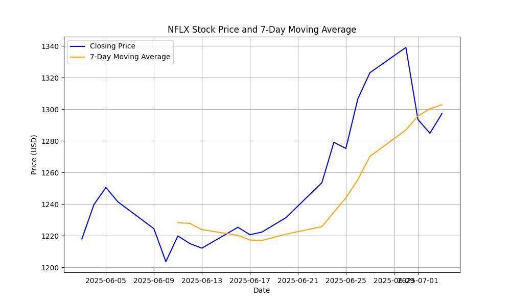

# Stock Price Tracker Bot

## Overview

A Python-based bot that automates real-time stock price tracking for financial analysis. Fetches historical stock data using the **yfinance** API, calculates a 7-day moving average for trading insights, stores data in a CSV file, and generates visualizations using **Matplotlib**. Designed to support trading decision-making by streamlining data collection and analysis.

## Features

- Fetches 30 days of stock data (Open, Close, High, Low, Volume) for any valid ticker symbol.
- Computes a 7-day moving average to identify price trends.
- Saves data to a CSV file for persistence and further analysis.
- Generates and saves a plot of closing prices and moving average.

## Technologies Used

- **Python**: Core programming language.
- **yfinance**: API for fetching stock data.
- **Pandas**: Data processing and CSV storage.
- **Matplotlib**: Data visualization.

## Installation

1. Clone the repository:

   ```bash
   git clone https://github.com/sethidhruv188/StockPriceTracker.git
   cd StockPriceTracker
   ```

2. Install dependencies:

   ```bash
   pip install -r requirements.txt
   ```

3. Run the script:

   ```bash
   python StockPriceTracker.py
   ```

## Usage

1. Run the script and enter a stock ticker (e.g., `AAPL` for Apple, `MSFT` for Microsoft).
2. The bot fetches 30 days of stock data, calculates the 7-day moving average, saves the data to `{ticker}_stock_data.csv`, and generates a plot as `{ticker}_stock_plot.png`.
3. Example output files:
   - `NFLX_stock_data.csv`: Contains stock data with moving average.
   - `NFLX_stock_plot.png`: Visualizes closing prices and moving average.

## Sample Output

\## Relevance to FinTech

This project demonstrates skills in **data analytics**, **Python**, and **automation**, aligning with financial services needs for real-time trading data analysis and low-latency systems, such as those used at Morgan Stanley.

## Future Improvements

- Add support for multiple tickers in a single run.
- Integrate with AWS Lambda for serverless deployment.
- Implement real-time alerts for price thresholds.

## Author

Dhruv Sethi | LinkedIn | GitHub
